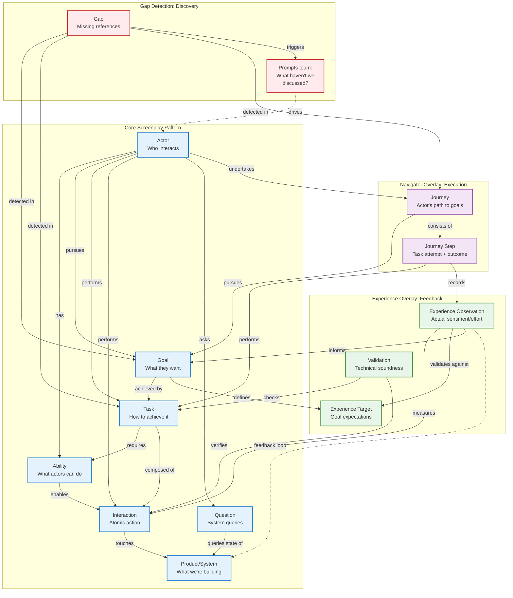
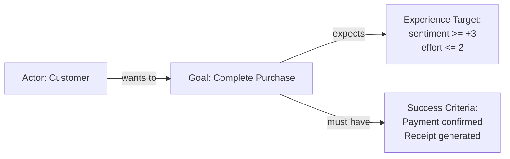
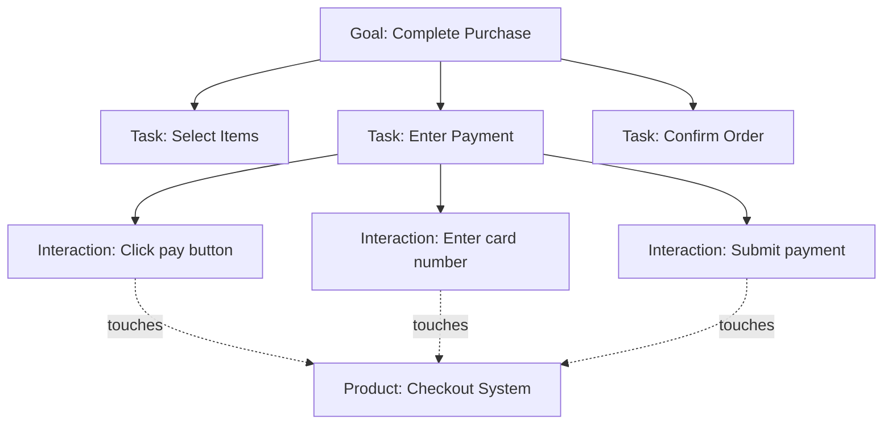
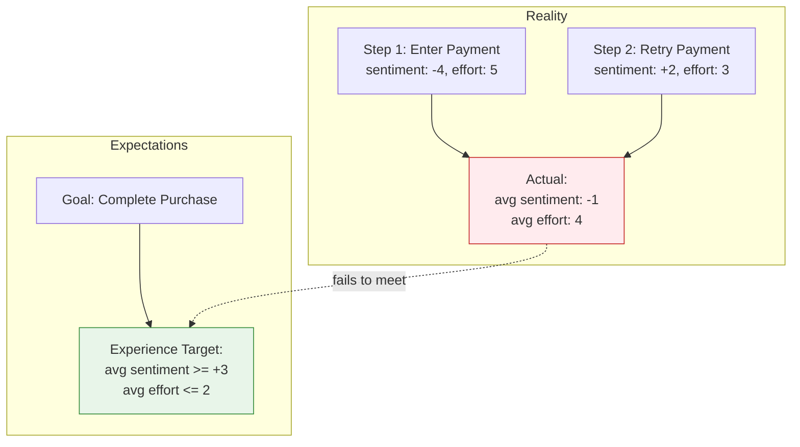
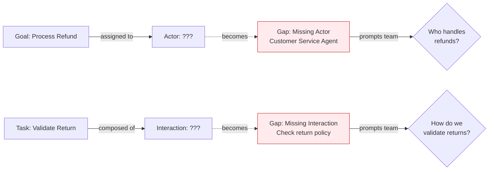
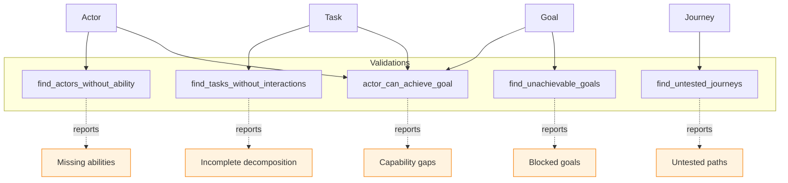
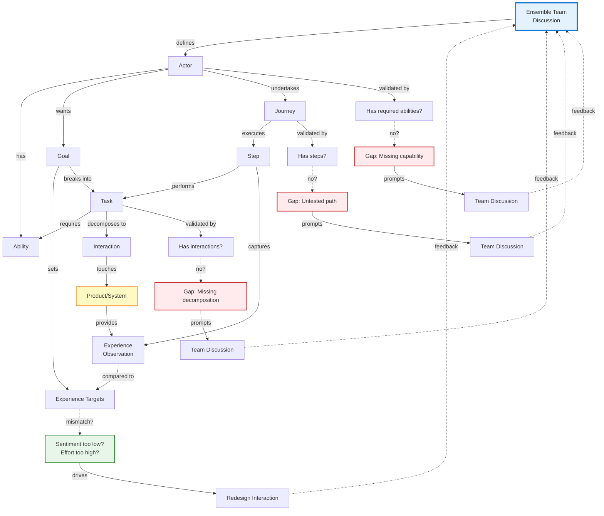

# Screenplay Model Architecture

This document provides a comprehensive visualization of the Screenplay Model, showing how all pieces fit together to drive product evolution through ensemble coding sessions.

## Overview

The Screenplay Model is a multi-layered architecture that connects **motivation** (what people want) to **execution** (how systems work) while capturing **experience** (how well it meets their needs). This creates a feedback loop that guides product development based on real user sentiment and technical validation.

## Complete Model Architecture



## How the Model Drives Product Evolution

### 1. Motivation Layer (Goals & Actors)

**Goals** define what actors want to achieve, with explicit success criteria and experience targets (e.g., "checkout should feel smooth", "search should be fast"). This is the **"why"** that steers product development.



### 2. Execution Layer (Tasks & Interactions)

**Tasks** break down goals into achievable steps, each composed of **Interactions** (atomic touchpoints with the product). This is the **"how"** that describes system behavior.



### 3. Navigator Layer (Journeys & Steps)

**Journeys** capture the actual path an actor takes, including retries and failures. **Steps** record outcomes and timing, creating telemetry that reveals where actors struggle.

```mermaid
sequenceDiagram
    participant Actor
    participant Journey
    participant Step1
    participant Step2
    participant Task
    
    Actor->>Journey: Start Monthly Close
    Journey->>Step1: Try Task: Enter Payment
    Step1->>Task: Execute
    Task-->>Step1: outcome: blocked (card declined)
    Note over Step1: Sentiment: -4 (frustrated)
    
    Journey->>Step2: Retry Task: Enter Payment
    Step2->>Task: Execute
    Task-->>Step2: outcome: success
    Note over Step2: Sentiment: +2 (relieved)
```

### 4. Experience Layer (Sentiment & Validation)

**Experience Observations** capture how actors feel during each step (sentiment: -5 to +5, effort: 1-5). These are compared against **Experience Targets** defined on goals. This feedback loop reveals whether the product is meeting expectations.



### 5. Gap Detection (What's Missing)

**Gaps** are discovered when entities reference IDs that don't exist yet. This is a **feature**, not a bug—it prompts the team to realize what they haven't discussed.



### 6. Validation & Technical Soundness

The model includes built-in validations that ensure technical correctness:

- **Ability Matching**: Can actors actually perform their assigned tasks?
- **Composition Checking**: Are tasks properly decomposed into interactions?
- **Journey Completeness**: Have all paths been tested?
- **Goal Achievability**: Can assigned actors achieve their goals?



## Complete Feedback Loop

Here's how everything works together to drive product evolution:



## Entity Relationships Reference

### Core Entities

| Entity | Purpose | Key Properties | Relationships |
|--------|---------|----------------|---------------|
| **Actor** | Who interacts with the system | abilities, constraints | has abilities, pursues goals, performs tasks |
| **Goal** | What actors want to achieve | success_criteria, priority | assigned to actors, achieved by tasks, has experience targets |
| **Task** | Steps to achieve goals | required_abilities, goal_ids | composed of interactions, requires abilities |
| **Interaction** | Atomic product touchpoints | preconditions, effects | part of tasks, touches product |
| **Question** | System state queries | asks_about | asked by actors, about product state |
| **Journey** | Actor's execution path | actor_id, goal_ids | undertaken by actor, pursues goals, consists of steps |
| **Journey Step** | Task attempt with outcome | task_id, outcome, timestamp | performs task, records observation |

### Overlay Entities

| Entity | Purpose | Key Properties | Relationships |
|--------|---------|----------------|---------------|
| **Experience Target** | Expected sentiment/effort for goals | metric, target, stage, channel | defined on goals |
| **Experience Observation** | Actual sentiment/effort from steps | metric, value, touchpoint | captured at steps, measures interactions |
| **Gap** | Missing referenced entity | expected_type, referenced_by | detected in goals/tasks/journeys, prompts discussion |
| **Validation** | Technical soundness check | - | checks tasks, verifies interactions, reports issues |

## Visualization Color Scheme

The live D3 visualization uses these colors (color-blind safe):

- **Actor** (blue #2563EB): The people or systems who interact
- **Goal** (green #059669): What we're trying to achieve
- **Task** (purple #7C3AED): How we break down work
- **Interaction** (orange #EA580C): Atomic touchpoints with the product
- **Gap** (red #DC2626): What's missing—prompts discussion
- **Question** (cyan): Queries about system state

## How This Steers Product Evolution

### 1. Customer Sentiment on Interactions

Experience Observations capture how customers feel about each interaction:
- **Positive sentiment** (+3 to +5) → Keep it, it's working well
- **Neutral sentiment** (-2 to +2) → Could be improved
- **Negative sentiment** (-5 to -2) → Pain point, needs redesign

These observations roll up to goals, showing whether the product is meeting customer needs.

### 2. Technical Soundness through Validation

Built-in query tools validate the model:
- Are tasks properly decomposed? (`find_tasks_without_interactions`)
- Can actors do what we ask? (`find_actors_without_ability`)
- Are goals achievable? (`find_unachievable_goals`)
- Have all paths been tested? (`find_untested_journeys`)

These validations catch design flaws before implementation.

### 3. Gap-Driven Discovery

When you reference something that doesn't exist yet (e.g., "the payment processor handles this"), a red "?" node appears. This visual cue prompts the team to:
- Define the missing actor/interaction/task
- Discuss capabilities and constraints
- Decompose complex actions into atomic interactions
- Test edge cases and failure paths

### 4. Real-Time Feedback Loop

As the ensemble team discusses the system with their AI agent:
1. Agent creates/updates entities based on conversation
2. Visualization updates within 1 second
3. Gaps appear, prompting clarifying questions
4. Experience targets guide what to measure
5. Validations catch technical issues
6. Team iterates based on visual feedback

This creates a **living specification** that evolves with the conversation, ensuring everyone stays synchronized on what's being built and why.

## Query Tools for Insights

The model includes 5 analytical query tools that surface insights:

### Capability Analysis
```
actor_can_achieve_goal(actor_id, goal_id)
→ Returns: Can do it? Why/why not? Missing abilities?
```

### Gap Discovery
```
find_actors_without_ability(ability)
→ Returns: Which actors lack this capability?

find_tasks_without_interactions(goal_id?)
→ Returns: Which tasks need decomposition?

find_untested_journeys()
→ Returns: Which paths haven't been executed?
```

### Goal Validation
```
find_unachievable_goals()
→ Returns: Which goals are blocked? Why? Who's assigned?
```

These queries turn the model into an analytical tool that answers questions like:
- "Can Maria process refunds?" → Check if she has required abilities
- "Which tasks aren't fleshed out yet?" → Find empty composed_of arrays
- "What journeys haven't been tested?" → Find journeys with no steps
- "Are there blocked goals?" → Check if assigned actors have required abilities

## Example: E-Commerce Checkout

Here's a concrete example showing all layers working together:

**Goal**: Customer completes purchase
- **Experience Target**: sentiment ≥ +3, effort ≤ 2
- **Success Criteria**: Payment confirmed, receipt generated

**Actor**: Customer
- **Abilities**: Browse catalog, enter payment info, read email
- **Constraints**: Distrusts sites with poor security

**Task**: Enter payment information
- **Required Abilities**: Enter payment info
- **Composed Of**:
  - Interaction: Click "Pay Now" button
  - Interaction: Enter card number
  - Interaction: Enter CVV code
  - Interaction: Submit payment form

**Journey**: "First-time purchase"
- **Actor**: Customer
- **Goals**: Complete purchase
- **Steps**:
  1. Task: Browse products → success (sentiment: +4, effort: 1)
  2. Task: Add to cart → success (sentiment: +3, effort: 1)
  3. Task: Enter payment → **blocked** (sentiment: -5, effort: 5, "security warning")
  4. Task: Enter payment → retry, success (sentiment: +1, effort: 3, "still nervous")

**Outcome**: Average sentiment (+0.75) and effort (2.5) **fail to meet target** (+3, 2)

**Action**: Team discusses why security warning appeared, realizes they need to:
- Add interaction: "Display security badges"
- Add interaction: "Show SSL certificate"
- Update actor constraint: "Needs visible trust signals"
- Retest journey with improvements

This is how customer sentiment on interactions directly drives product evolution—the model surfaces where customers struggle and why, guiding the team to make targeted improvements.

## Summary

The Screenplay Model connects three critical layers:

1. **Motivation** (Goals & Experience Targets) - What customers want and expect
2. **Execution** (Tasks, Interactions, Journeys) - How the system works
3. **Feedback** (Observations, Validations, Gaps) - How well it's working

Together, these create a feedback loop where:
- **Customer sentiment** guides which interactions to improve
- **Technical validations** ensure the design is sound
- **Gap detection** prompts teams to fill in missing details
- **Real-time visualization** keeps everyone synchronized

This turns ensemble coding conversations into a living specification that evolves based on both customer needs and technical constraints, steering product development in the right direction.
