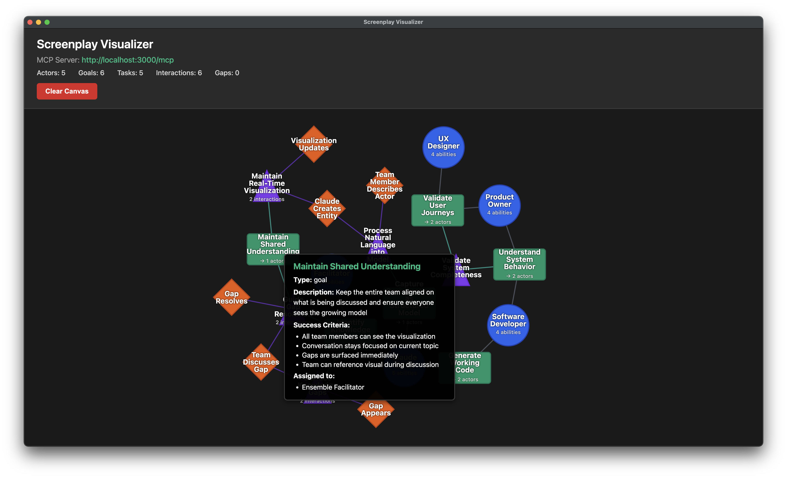

# Screenplay Visualizer

A real-time **conversation listener** and visualizer for ensemble coding sessions. As your team discusses requirements, problems, or ideas, this tool captures what's been said and projects a live diagram on a second screen. Your MCP-enabled agent (Github Copilot, Claude Code, Windsurf, etc.) listens to the conversation and creates the visualization in real-time.

**Core Philosophy:** This tool doesn't enforce a perfect model - it **listens and diagrams what it hears**. Gaps (missing connections) are intentional features that visually prompt the team to elaborate on undefined concepts. The goal is to keep everyone synchronized on what's been discussed and surface what needs more conversation.



## Visualization

The app uses **[ReactFlow](https://reactflow.dev/)** for an interactive, real-time visualization. Each entity type (Actor, Goal, Task, Interaction) is rendered as a distinct, interactive React component. Features include:

- **Double-click to edit**: Click any node to edit its name inline
- **Interactive controls**: Zoom, pan, minimap for easy navigation
- **Real-time updates**: Visualization updates instantly as you discuss and define entities
- **Gap detection**: Missing entities show as red "?" nodes, prompting further discussion

See **[REACTFLOW.md](./REACTFLOW.md)** for detailed documentation about the visualization system.

## Screenplay Pattern

This diagram below illustrates the relationships between items in the Screenplay Pattern. The pattern focuses on **user-centric modeling** - capturing how actors (people or systems) interact with a product to achieve their goals and deliver desired experiences.


**Product-Centric Focus:** The Screenplay pattern evolved from PageObjects to be more user-centric. Rather than thinking about "systems under test" (a tester-centric view), we model the **Product** and how actors experience it. This tool helps teams capture requirements for intended experiences, visualize what's been discussed, and surface gaps in understanding that need further conversation.

### Complete Model Documentation

For a comprehensive visualization showing how all pieces fit together, including:
- How customer sentiment on interactions drives product evolution
- How technical validations ensure soundness
- How gap detection prompts discovery
- How the Navigator and Experience overlays work

See **[MODEL.md](./MODEL.md)** for detailed diagrams and explanations.

### Navigator & Experience Overlays

- See SPEC: [Navigator Overlay: Journeys & Steps](./SPEC.md#navigator-overlay-journeys--steps-across-the-screenplay-model)
- See SPEC: [Experience Overlay: Connecting Motivation (Goals & Experiences) to Execution](./SPEC.md#experience-overlay-connecting-motivation-goals--experiences-to-execution)

## For Users

### Download & Install

Pre-built releases for macOS, Windows, and Linux are available on the [Releases](../../releases) page.

Alternatively, see the Developer section below to run from source.

### What It Does

The Screenplay Visualizer is a **conversation listener** that creates a live diagram of your team's discussion about product requirements and user experiences. It runs an MCP (Model Context Protocol) server that your agent connects to during ensemble coding sessions. As your team talks about requirements, problems, feedback, or brainstorms ideas about how users will experience the product, the agent captures what's been mentioned:

- **Actors** (blue circles) - People or systems who interact with the product
- **Goals** (green squares) - Desired outcomes or experiences users want to achieve
- **Tasks** (purple triangles) - Activities users perform to accomplish their goals
- **Interactions** (orange diamonds) - Touchpoints where users interact with the product
- **Gaps** (red dashed "?" circles) - **Important:** Things referenced but not yet discussed - these prompt the team to elaborate

The visualization updates within 1 second of any change, keeping the entire team synchronized on what product experiences have been discussed. **Gaps are features, not bugs** - they surface aspects of the user experience that need more conversation.

### How To Use

1. **Launch the app** - The Screenplay Visualizer window opens with an empty canvas
2. **Note the MCP URL** - Displayed in the header (typically `http://localhost:3000/mcp`)
3. **Configure Your Agent** - Add the MCP server to your agent configuration
4. **Start your ensemble session** - As your agent processes your conversation, entities appear in real-time
5. **Project on second screen** - The visualization is designed to be readable from across the room

**Gap-Driven Development:** Red "?" nodes appear when you reference something not yet defined (e.g., "users interact with the payment processor" before you've discussed how the payment processor works). **This is intentional and valuable** - gaps visually prompt the team to notice aspects of the product experience that haven't been elaborated yet and encourage further discussion to create a cohesive understanding of how users will experience the system.

### Data Storage

All model data is saved to your system's application data directory:

- **macOS:** `~/Library/Application Support/screenplay-visualizer/.screenplay/`
- **Linux:** `~/.config/screenplay-visualizer/.screenplay/`
- **Windows:** `%APPDATA%/screenplay-visualizer/.screenplay/`

Each entity type (actors, goals, tasks, interactions, questions, journeys) is stored in its own JSON file.

## For Developers

### Prerequisites

- Node.js 20+ (tested with v22.13.0)
- npm or yarn

### Running from Source

```bash
# Install dependencies
npm ci

# Start the app (builds TypeScript and launches Electron)
npm start
```

The Screenplay Visualizer window will open with the MCP server running at `http://localhost:3000/mcp`.

### Development Workflow

```bash
npm run build           # Compile TypeScript (src/ → dist/)
npm run clean           # Remove dist/ directory
npm start               # Build and launch app
```

### Project Structure

```
screenplay-visualizer/
├── src/
│   ├── main.ts              # Electron main process
│   ├── preload.ts           # IPC bridge
│   ├── lib/
│   │   ├── schemas.ts       # Zod schemas + TypeScript types
│   │   ├── storage.ts       # JSONStorage with EventEmitter
│   │   └── queries.ts       # Query helper functions
│   ├── mcp-server/
│   │   └── tools.ts         # 32 MCP tools (CRUD, composition, queries)
│   └── tests/
│       ├── run-all-scenarios.ts     # Test runner
│       ├── harness/                 # MCP client + test framework
│       └── scenarios/               # E2E test scenarios
├── renderer/
│   ├── index.html           # UI structure
│   ├── styles.css           # Projection-ready styles
│   └── app.js               # D3 force layout visualization
└── dist/                    # Compiled JavaScript (generated)
```

### Testing

**Run all tests:**
```bash
npm run test:e2e
```

**Note:** The Electron app must be running (`npm start`) before running tests.

**Slow mode** (watch visualization changes):
```bash
npm run test:e2e:slow                  # 2 second delay between steps
npm run test:e2e -- --delay=5000       # Custom delay
STEP_DELAY=3000 npm run test:e2e       # Via environment variable
```

Test scenarios are in `src/tests/scenarios/`. Three scenarios exercise all 32 MCP tools:
1. `comprehensive-crud-and-composition.ts` - All CRUD and composition tools
2. `query-tools.ts` - Analytical query tools
3. `visualizer-itself.ts` - Models the visualizer's own audience and purpose

### Packaging

Create distributable apps:

```bash
npm run package          # Unpacked app for testing (release/ directory)
npm run package:mac      # macOS .dmg and .zip
npm run package:win      # Windows installer and portable .exe
npm run package:linux    # Linux AppImage and .deb
```

**Note:** First-time packaging downloads platform binaries (~200MB).

### Architecture

```
Electron App
├── Main Process
│   ├── FastMCP Server (HTTP streaming on localhost:3000)
│   ├── JSONStorage (EventEmitter, atomic writes)
│   └── IPC Bridge to Renderer
└── Renderer Process
    ├── D3 Force Layout Visualization
    └── Real-time Updates (<1s latency)
```

**MCP Tools:** 32 tools across 4 categories:
- **Phase 1 (5):** Basic CRUD (define_actor, define_goal, delete_actor, get_full_model, clear_model)
- **Phase 2 (15):** Full CRUD for all entity types (tasks, interactions, questions, journeys)
- **Phase 2.5 (7):** Composition tools (assign_goal_to_actor, add_interaction_to_task, record_journey_step, etc.)
- **Phase 3 (5):** Query/analytical tools (find_actors_without_ability, actor_can_achieve_goal, find_unachievable_goals, etc.)

For detailed documentation, see `CLAUDE.md` (for AI assistants) and `SPEC.md` (technical specification).

## License

MIT
