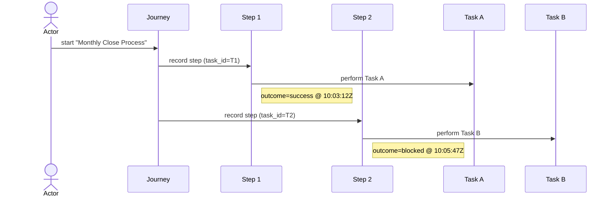
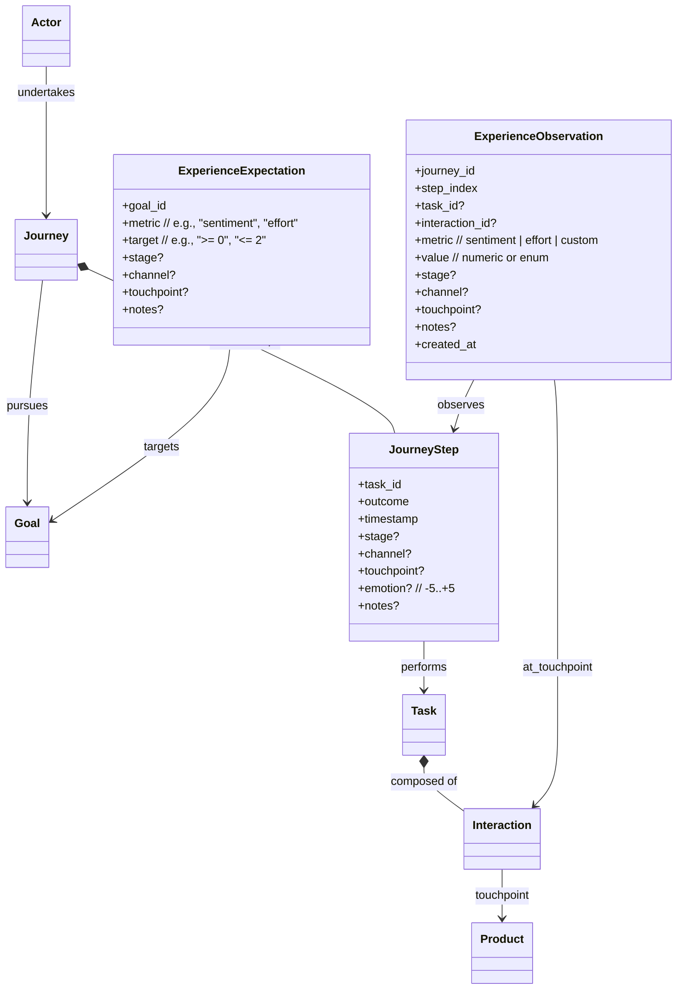

# Screenplay MCP Server + Electron Visualizer

**Context:** Single-screen ensemble coding where 4-6 people discuss software behavior with one Claude Code instance. Screen 1: Claude Code + evolving prototype. Screen 2 (projected): This visualization showing the specification model as it grows. The visualization must be **readable from across a room** and **update fast enough to feel responsive to conversation**.

---

## Electron Implementation

Gaps are features, not bugs. The visualization surfaces what hasn't been discussed yet. A task referencing a non-existent interaction shows as a dangling edge—this prompts the team to realize "wait, how does login actually work?"

## Architecture

```
Electron App (Single Process, No Network Concerns)
├── Main Process
│   ├── FastMCP Server (localhost, dynamic port ≥3000)
│   ├── JSONStorage (EventEmitter, in-memory cache)
│   └── IPC Bridge to Renderer
└── Renderer Process
    ├── Single-Page App (tabs but no navigation)
    ├── D3 Force Layout (primary view)
    └── Real-time Updates (300-500ms animations)
```

**Data Flow:**

1. Team discusses → Claude Code calls MCP tools → Storage updates + emits event
2. Main forwards event to Renderer via IPC (~10ms)
3. Renderer applies delta, triggers D3 .join() transition (~500ms)
4. **Total latency budget: <1s from tool call to visible change**

## Unified Data Model

Use these TypeScript interfaces for **both** MCP tool inputs/outputs **and** D3 visualization data. Zod schemas mirror these exactly.

```typescript
// Base for all entities
interface Entity {
  id: string;              // UUID - concept anchor
  name: string;            // Human label
  description: string;     // Free text
  created_at: string;      // ISO timestamp
  updated_at: string;      // ISO timestamp
}

interface Actor extends Entity {
  abilities: string[];     // What they can do
  constraints: string[];   // What prevents them
}

interface Goal extends Entity {
  success_criteria: string[];
  priority: "low" | "medium" | "high";
  assigned_to: string[];   // Actor IDs (may reference missing actors)
}

interface Task extends Entity {
  required_abilities: string[];
  composed_of: string[];   // Interaction IDs (may reference missing interactions)
  goal_ids: string[];      // Goal IDs this task helps achieve (added Phase 3)
}

interface Interaction extends Entity {
  preconditions: string[];
  effects: string[];
}

interface Question extends Entity {
  asks_about: string;      // What system state this queries
}

interface Journey extends Entity {
  actor_id: string;        // May reference missing actor
  goal_ids: string[];      // May reference missing goals
  steps: JourneyStep[];
}

interface JourneyStep {
  task_id: string;         // May reference missing task
  outcome: string;
  timestamp: string;       // ISO timestamp
}

// Visualization-specific (not stored)
interface Gap {
  id: string;              // UUID of the missing entity
  expected_type: "actor" | "goal" | "task" | "interaction";
  referenced_by: string[]; // IDs of entities that reference this gap
}
```

**Gap Handling:**

- When rendering, if `task.composed_of` includes unknown ID, D3 creates a `Gap` node
- Gap nodes render as dashed circles with "?" and the expected type
- Clicking a gap shows "Referenced by: Task A, Task B" in tooltip
- When the missing entity is defined, gap node morphs into real node (same UUID, smooth transition)

## Storage Layer

**Location:** `app.getPath('userData')/.screenplay/` (platform-specific app data directory)

**Files:**

- `actors.json`, `goals.json`, `tasks.json`, `interactions.json`, `questions.json`, `journeys.json`
- Each file contains `Entity[]` (empty array if not exists)

**JSONStorage Class:**

```javascript
class JSONStorage extends EventEmitter {
  constructor(basePath) {
    this.cache = new Map(); // type -> Entity[]
    this.basePath = basePath;
  }

  async load(type) {
    // Read file, parse, cache, return Entity[]
  }

  async save(type, entity) {
    // Validate with Zod
    // Add to cache
    // Atomic write (temp file + rename)
    // Emit: { type: "create", entity: type, data: entity }
  }

  async update(type, id, partial) {
    // Find in cache, merge, validate, write
    // Emit: { type: "update", entity: type, data: updated }
  }

  async delete(type, id) {
    // Remove from cache, write
    // Emit: { type: "delete", entity: type, data: { id } }
  }

  async getAll(type) {
    // Return from cache (load if not present)
  }
}
```

**Event Format:**

```javascript
{
  type: "create" | "update" | "delete",
  entity: "actor" | "goal" | "task" | "interaction" | "question" | "journey",
  data: Entity | { id: string }
}
```

## MCP Tool Specification

**Philosophy:** Tools are thin wrappers around storage. Validation happens in storage layer. Tools return immediately after emitting change event.

**Phase 1 Implementation Status:**
- ✅ `define_actor` - Create actors
- ✅ `define_goal` - Create goals with assignments
- ✅ `delete_actor` - Delete actors
- ✅ `get_full_model` - Retrieve all entities and computed gaps
- ✅ `clear_model` - Clear all data (for testing)

**Phase 2 Implementation Status:**
- ✅ **Actor CRUD:** `update_actor`, `delete_actor` (already done in Phase 1)
- ✅ **Goal CRUD:** `update_goal`, `delete_goal`
- ✅ **Task CRUD:** `define_task`, `update_task`, `delete_task`
- ✅ **Interaction CRUD:** `define_interaction`, `update_interaction`, `delete_interaction`
- ✅ **Question CRUD:** `define_question`, `update_question`, `delete_question`
- ✅ **Journey CRUD:** `define_journey`, `update_journey`, `delete_journey`
- ✅ **Total:** 20 tools implemented (was 5, added 15)
- ✅ **Testing:** Comprehensive bookkeeping scenario with 31 test steps
- ✅ **Gap detection:** Working for all entity types

**Current State:** Basic CRUD operations complete. System can model actors, goals, tasks, interactions, questions, and journeys with full gap detection. However, **not ready for real ensemble conversations** - need richer interaction tools first (see Phase 2.5 below).

**Phase 2.5: Composition & Relationship Tools (NEEDED BEFORE REAL USAGE)**

Before using this in actual ensemble coding sessions, we need tools that better express relationships without requiring manual CRUD operations:

### CRUD Tools (18 total - PARTIALLY COMPLETE)

**Creation Pattern:**

```javascript
define_actor({ name, description, abilities, constraints })
  → storage.save("actor", { id: uuid(), name, description, abilities, constraints, created_at: now(), updated_at: now() })
  → { success: true, data: Actor }
```

**Update Pattern:**

```javascript
update_actor({ id, name?, description?, abilities?, constraints? })
  → storage.update("actor", id, { ...partials, updated_at: now() })
  → { success: true, data: Actor }
```

**Deletion Pattern:**

```javascript
delete_actor({ id })
  → storage.delete("actor", id)
  → { success: true, data: { id } }
```

Apply this pattern to: `actor`, `goal`, `task`, `interaction`, `question`, `journey`

**Status:** ✅ All CRUD operations implemented (20 tools total)

---

### Phase 2.5: Composition Tools (7) - ✅ **COMPLETE (October 2025)**

**Problem:** CRUD tools required agents to manually manage arrays. In conversation, people say "assign this goal to Maria" not "update goal with assigned_to array [maria_id, ...existing]".

**Solution:** 7 idempotent composition tools that handle array manipulation internally.

**Implementation:**
- All tools use `storage.update()` to modify existing entities (not `storage.save()` which creates duplicates)
- All tools are idempotent (safe to call multiple times)
- Error if entity not found
- No validation that referenced IDs exist (allows gaps)

**Implemented tools:**
1. `assign_goal_to_actor` - Add actor to goal's assigned_to array
2. `unassign_goal_from_actor` - Remove actor from goal's assigned_to array
3. `add_interaction_to_task` - Add interaction to task's composed_of array
4. `remove_interaction_from_task` - Remove interaction from task's composed_of array
5. `record_journey_step` - Append step to journey's steps array
6. `add_goal_to_journey` - Add goal to journey's goal_ids array
7. `remove_goal_from_journey` - Remove goal from journey's goal_ids array

---

### Phase 3: Query Tools (5) - ✅ **COMPLETE (October 2025)**

**Problem:** During ensemble coding, teams need to ask analytical questions like "Who can do X?", "Which goals are blocked?", "What work hasn't been decomposed yet?"

**Solution:** 5 query tools that analyze the model and surface insights.

**Implementation:**
- All query logic in `src/lib/queries.ts` (pure functions, ~240 lines)
- Tools are thin wrappers that fetch data and call query functions
- Return structured results for agent interpretation
- **Schema Enhancement:** Added `goal_ids: string[]` to Task entity to enable task-to-goal relationship queries
- Tools filter tasks by goal to provide accurate capability analysis

**Implemented tools:**
1. `find_actors_without_ability` - Find actors missing a specific ability
2. `find_tasks_without_interactions` - Find tasks with empty composed_of (need decomposition)
3. `find_untested_journeys` - Find journeys with no steps (not yet executed)
4. `actor_can_achieve_goal` - Check if actor can achieve goal (with detailed reasoning and missing abilities)
5. `find_unachievable_goals` - Find goals where assigned actors lack required abilities

**Key Features:**
- Ability checking uses task-to-goal relationships for accurate analysis
- Returns detailed reasoning for why goals are/aren't achievable
- Lists specific missing abilities when actors can't complete goals
- Handles edge cases (missing actors, no tasks defined, empty goals)

**Status:** ✅ Implemented with comprehensive test coverage (8 test steps, all passing)

---

### Phase 4: Visualization Tools (5) - **NICE TO HAVE**

Specialized views for different analysis needs:

```javascript
get_full_model()
  → Return { actors[], goals[], tasks[], interactions[], questions[], journeys[], gaps[] }
  → gaps[] computed by scanning all references and collecting missing IDs

get_actor_capability_map()
  → Return { actors[], goals[], edges: [{ actor_id, goal_id, can_achieve: boolean }] }

get_journey_flow({ journey_id })
  → Return journey + hydrated actor/goals/tasks (include gaps if refs missing)

get_interaction_dependencies({ task_id? })
  → Return { tasks[], interactions[], edges: [{ task_id, interaction_id }] }

get_goal_coverage_matrix()
  → Return { actors[], goals[], matrix: boolean[][] } where matrix[i][j] = actor i can achieve goal j

get_recent_changes({ since_timestamp? })
  → Default since_timestamp = now() - 1 hour
  → Return changes from storage event log (store last 100 events in memory)
```

**Status:** ✅ `get_full_model` implemented. Others ❌ not yet needed - can build with client-side logic if required.

---

## Implementation Roadmap

### ✅ Phase 1 + 2 + 2.5 + 3: Complete (32 tools, October 2025)
- Electron app with D3 force-directed graph
- MCP server with FastMCP on localhost:3000
- Full CRUD for actors, goals, tasks, interactions, questions, journeys
- 7 composition tools for natural conversation flows
- 5 query tools for analytical insights
- Gap detection and real-time updates (<1s latency)
- 2 comprehensive test scenarios, all passing

**All tools implemented:**
1. `define_actor` - Create actors with abilities/constraints
2. `define_goal` - Create goals with success criteria
3. `get_full_model` - Retrieve all entities + gaps
4. `clear_model` - Reset for testing
5. `delete_actor` - Remove actor (creates gaps)
6. `update_actor` - Modify actor properties
7. `update_goal` - Modify goal properties
8. `define_task` - Create tasks with required abilities
9. `update_task` - Modify task properties
10. `delete_task` - Remove task
11. `define_interaction` - Create atomic interactions
12. `update_interaction` - Modify interaction properties
13. `delete_interaction` - Remove interaction
14. `define_question` - Create open questions
15. `update_question` - Modify question properties
16. `delete_question` - Remove question
17. `define_journey` - Create actor journeys
18. `update_journey` - Modify journey properties
19. `delete_journey` - Remove journey
20. `delete_goal` - Remove goal
21. `assign_goal_to_actor` - Assign goal to actor (idempotent)
22. `unassign_goal_from_actor` - Unassign goal from actor (idempotent)
23. `add_interaction_to_task` - Compose task from interactions (idempotent)
24. `remove_interaction_from_task` - Remove interaction from task (idempotent)
25. `record_journey_step` - Append step to journey (with outcome)
26. `add_goal_to_journey` - Add goal to journey (idempotent)
27. `remove_goal_from_journey` - Remove goal from journey (idempotent)
28. `find_actors_without_ability` - Find actors missing ability (query)
29. `find_tasks_without_interactions` - Find empty tasks (query)
30. `find_untested_journeys` - Find journeys with no steps (query)
31. `actor_can_achieve_goal` - Check actor capability (query)
32. `find_unachievable_goals` - Find blocked goals (query)

### 🔮 Phase 4: Future (as needed)
- **Visualization Tools:** Add specialized views based on usage feedback
- **Advanced Queries:** Dependency analysis, critical path, coverage matrices

---

## Electron Implementation**Main Process (src/main.ts):**

```javascript
import { app, BrowserWindow, ipcMain } from 'electron';
import { McpServer } from 'fastmcp';
import { JSONStorage } from './lib/storage.js';
import { registerTools } from './mcp-server/tools/index.js';

let mainWindow;
let storage;
let server;
let serverPort;

app.on('ready', async () => {
  // Initialize storage
  const dataPath = app.getPath('userData') + '/.screenplay';
  storage = new JSONStorage(dataPath);
  await storage.initialize();

  // Start MCP server
  server = new McpServer();
  registerTools(server, storage);
  serverPort = await findAvailablePort(3000);
  await server.listen(serverPort);

  // Create window
  mainWindow = new BrowserWindow({
    width: 1920,
    height: 1080,
    webPreferences: {
      preload: path.join(__dirname, 'preload.js'),
      contextIsolation: true,
      nodeIntegration: false
    }
  });

  mainWindow.loadFile('renderer/index.html');

  // Forward storage events to renderer
  storage.on('change', (event) => {
    mainWindow.webContents.send('model-updated', event);
  });

  // Send server URL
  mainWindow.webContents.on('did-finish-load', () => {
    mainWindow.webContents.send('server-started', `http://localhost:${serverPort}/mcp`);
  });

  // IPC handlers
  ipcMain.handle('get-model', async () => {
    return {
      actors: await storage.getAll('actor'),
      goals: await storage.getAll('goal'),
      tasks: await storage.getAll('task'),
      interactions: await storage.getAll('interaction'),
      questions: await storage.getAll('question'),
      journeys: await storage.getAll('journey')
    };
  });
});
```

**Preload (preload.js):**

```javascript
import { contextBridge, ipcRenderer } from 'electron';

contextBridge.exposeInMainWorld('screenplay', {
  onServerStarted: (callback) => ipcRenderer.on('server-started', (_, url) => callback(url)),
  onModelUpdate: (callback) => ipcRenderer.on('model-updated', (_, event) => callback(event)),
  getModel: () => ipcRenderer.invoke('get-model')
});
```

## Renderer: D3 Force Layout Strategy

**Goal:** Single zoomable/pannable canvas showing all entities. Force layout keeps related items close, unrelated items apart.

**Node Types:**

- **Actor** (circle, blue, radius=20)
- **Goal** (square, green, size=30)
- **Task** (triangle, purple, size=25)
- **Interaction** (diamond, orange, size=20)
- **Gap** (dashed circle, red, radius=15, "?")

**Edge Types:**

- **Goal Assignment** (Actor → Goal, solid gray)
- **Goal-Task Relationship** (Goal → Task, solid teal, shows which tasks help achieve which goals)
- **Task Composition** (Task → Interaction, solid purple)
- **Can Achieve** (Actor → Goal, dashed green, only if true)
- **Gap Reference** (Any → Gap, dashed red)

**Force Configuration:**

```javascript
const simulation = d3.forceSimulation(nodes)
  .force('link', d3.forceLink(edges).id(d => d.id).distance(100))
  .force('charge', d3.forceManyBody().strength(-300))
  .force('center', d3.forceCenter(width / 2, height / 2))
  .force('collision', d3.forceCollide().radius(30));
```

**Update Pattern:**

```javascript
function updateVisualization(model) {
  // Compute gaps
  const gaps = findGaps(model);
  const nodes = [...model.actors, ...model.goals, ...model.tasks, ...model.interactions, ...gaps];
  const edges = buildEdges(model, gaps);

  // Bind data
  const nodeSelection = svg.selectAll('.node')
    .data(nodes, d => d.id)
    .join(
      enter => enter.append('g').attr('class', 'node')
        .call(renderNode)
        .style('opacity', 0)
        .transition().duration(500).style('opacity', 1),
      update => update.call(renderNode),
      exit => exit.transition().duration(300).style('opacity', 0).remove()
    );

  const edgeSelection = svg.selectAll('.edge')
    .data(edges, d => d.source.id + '-' + d.target.id)
    .join(/* similar pattern */);

  // Restart simulation with new nodes
  simulation.nodes(nodes);
  simulation.force('link').links(edges);
  simulation.alpha(0.3).restart(); // Gentle reheat, not full restart
}

function findGaps(model) {
  const allIds = new Set([...model.actors, ...model.goals, ...model.tasks, ...model.interactions].map(e => e.id));
  const gaps = new Map();

  // Check goal.assigned_to
  model.goals.forEach(goal => {
    goal.assigned_to.forEach(actor_id => {
      if (!allIds.has(actor_id)) {
        gaps.set(actor_id, { id: actor_id, expected_type: 'actor', referenced_by: [...(gaps.get(actor_id)?.referenced_by || []), goal.id] });
      }
    });
  });

  // Check task.composed_of
  model.tasks.forEach(task => {
    task.composed_of.forEach(interaction_id => {
      if (!allIds.has(interaction_id)) {
        gaps.set(interaction_id, { id: interaction_id, expected_type: 'interaction', referenced_by: [...(gaps.get(interaction_id)?.referenced_by || []), task.id] });
      }
    });
  });

  // Similar for journey.actor_id, journey.goal_ids, journey.steps[].task_id

  return Array.from(gaps.values());
}
```

**Visual Design for Projection:**

- **Fonts:** 18px labels (readable from 15ft)
- **Colors:** High contrast, color-blind safe
    - Actor: `#2563EB` (blue-600)
    - Goal: `#059669` (green-600)
    - Task: `#7C3AED` (purple-600)
    - Interaction: `#EA580C` (orange-600)
    - Gap: `#DC2626` (red-600)
- **Tooltips:** 24px font, show on click (not hover—projected screen)
- **Zoom:** Mouse wheel, min=0.5x, max=2x
- **Pan:** Click-drag background

**Secondary Views (current vs future):**

- Implemented now: Force Layout (primary, always visible) with header counters (Actors, Goals, Tasks, Interactions, Gaps)
- Deferred to future phases: Timeline (recent changes), Coverage Matrix (actors × goals), detailed Stats panels

Note: Keep 90% of screen time on the Force Layout; add the other views in later phases once we have real usage data.

## Phase 1: Walking Skeleton ✅ COMPLETE

**Acceptance Criteria (implemented):**

1. Electron starts and shows the MCP server URL in the header (e.g., http://localhost:3000/mcp).
2. Using the MCP server on http://localhost:3000/mcp with FastMCP httpStream JSON-RPC envelopes:
   - `define_actor` creates an actor; a blue circle appears within ~1s.
   - `define_goal` with assigned_to including a valid actor UUID creates a goal; a green square appears with a gray edge to the actor.
   - `define_goal` with a non-existent actor UUID creates a gap; the goal shows a red dashed edge to a red dashed "?" node.
   - `delete_actor` removes the actor; edges to any assigned goals turn into red dashed gap edges while goals remain.
   - `get_full_model` returns all entities plus computed gaps.
   - `clear_model` clears all data for test cleanup.
3. E2E test harness validates all tools and workflows, including complex scenarios like the bookkeeping system model.

**Phase 1 Complete:** All acceptance criteria met, ~800 lines of code, fully tested.

---

## Phase 2: Full CRUD Operations ✅ COMPLETE

**Acceptance Criteria (implemented):**

1. All 6 entity types support full CRUD:
   - **Create:** `define_actor`, `define_goal`, `define_task`, `define_interaction`, `define_question`, `define_journey`
   - **Read:** `get_full_model` (returns all entity types)
   - **Update:** `update_actor`, `update_goal`, `update_task`, `update_interaction`, `update_question`, `update_journey`
   - **Delete:** `delete_actor`, `delete_goal`, `delete_task`, `delete_interaction`, `delete_question`, `delete_journey`

2. Gap detection works for all relationship types:
   - Goals referencing missing actors
   - Tasks referencing missing interactions
   - Journeys referencing missing actors, goals, or tasks

3. Comprehensive test coverage:
   - Extended bookkeeping scenario exercises all CRUD operations
   - 31 test steps covering create, update, delete, and gap scenarios
   - Tests validate cascading effects (e.g., deleting actor creates gaps)

**Phase 2 Complete:** 20 tools total (was 5, added 15), ~1200 lines of code, all tests passing.

---

## Testing Strategy

The application uses an automated E2E test harness that connects to the MCP server:

- **E2E Tests**: Run `npm run test:e2e` to execute all test scenarios against the MCP server
- **Slow Mode**: Run `npm run test:e2e:slow` to add delays between steps for visual verification
- **Test Framework**: Located in `src/tests/`, uses the official MCP SDK client (`@modelcontextprotocol/sdk`)
- **Test Scenarios**: Individual scenario files in `src/tests/scenarios/` validate each tool and workflow
- **MCP Endpoint**: Running on `http://localhost:3000/mcp` using FastMCP's stateless HTTP streaming mode

### Current Test Coverage (All Phases)

The test harness validates:
- Tool execution and response format
- Data model consistency
- Gap detection and relationship handling
- State persistence across operations
- Complex workflows (e.g., the bookkeeping scenario with 4 actors, 6 goals, 3 tasks, 3 interactions, and gap evolution)
- Composition tools and idempotency
- Query tools and analytical insights

**Test Scenarios:**
1. `comprehensive-crud-and-composition.ts` - All 27 CRUD and composition tools (47 steps)
2. `query-tools.ts` - All 5 Phase 3 query tools (8 steps)

**Total:** 2 comprehensive scenarios, 55 test steps, all 32 tools verified ✅

---

## Current Project Status

**What Works:**
- ✅ Electron app with D3 force-directed graph visualization
- ✅ MCP server on localhost:3000 with 32 tools
- ✅ Real-time updates with <1s latency from tool call to visual change
- ✅ Full CRUD for actors, goals, tasks, interactions, questions, journeys
- ✅ Composition tools for natural conversation flow (idempotent)
- ✅ Query tools for analytical insights
- ✅ Gap detection for missing references
- ✅ Comprehensive test suite (2 scenarios, all passing)
- ✅ Bookkeeping conversation screenplay documenting expected usage

**Ready for Real Usage:**
- ✅ All Phase 1, 2, 2.5, and 3 tools implemented
- ✅ Natural conversation patterns supported
- ✅ Analytical queries for insights
- ✅ Comprehensive testing

**What's Next (Optional):**
- Phase 4: Advanced visualization tools (nice to have, not blocking)
- Real ensemble session testing with actual team
- Performance optimization for large models (100+ entities)

**Recommendation:** System is ready for real ensemble coding sessions! Phase 4 can be added based on actual usage feedback.

---

## What We're NOT Building

- Multi-user collaboration
- Undo/redo (LLM is the undo mechanism—just ask it to revert)
- Persistence beyond JSON files (no git integration, no database)
- Export to SVG/PNG (screenshot the window if needed)
- Custom layout algorithms (force layout handles everything)
- Search/filter UI (model should stay small enough to see all at once)

---

## Navigator Overlay: Journeys & Steps Across the Screenplay Model

Actors can realize their Goals in multiple ways by undertaking different Journeys. The Journey is the Actor's Navigator; Steps form the route (ordered, retriable events) across Tasks and their composing Interactions toward one or more Goals. This overlay clarifies how "execution flows" traverse the underlying Screenplay model.

```mermaid
classDiagram
    %% Core Screenplay
    class Actor
    class Goal
    class Task
    class Interaction
    class Product  %% Also known as System Under Test

    %% Navigator
    class Journey {
      +id
      +name
      +actor_id
      +goal_ids[*]
      +steps[*]
    }

    class JourneyStep {
      +task_id
      +outcome   // success | failure | blocked
      +timestamp
      %% Order is implied by index in steps[]
    }

    %% Relationships
    Journey --> "1" Actor : by
    Journey --> "0..*" Goal : pursues
    Journey *-- "0..*" JourneyStep : ordered steps
    JourneyStep --> "1" Task : performs
    Task *-- "0..*" Interaction : composed of
    Interaction --> Product : touches
```

Sequence view (optional):



Why retain Steps (not just Journey→Task):
- Preserve sequence and retries (same Task can appear multiple times)
- Capture per-attempt outcome and timestamp (telemetry)
- Enable analytics like "untested journeys"
- Surface gaps from missing tasks referenced by steps

Terminology alignment:
- Product (System Under Test): The boundary the Actor touches via Interactions; to CX audiences "Product" is clearer, hence "Product (System Under Test)" in diagrams

---

## Experience Overlay: Connecting Motivation (Goals & Experiences) to Execution

We treat Goals and Experiences as the "why" behind behavior, and connect them to the "how" (Journeys → Steps → Tasks → Interactions). We distinguish expected experience (targets tied to Goals) from observed experience (feedback/telemetry captured during Steps).

Conceptual mapping:
- Persona ↔ Actor
- Desired outcomes ↔ Goals
- Execution path ↔ Journey (may have multiple per goal)
- Ordered attempts ↔ Steps (outcome + time)
- Waypoints ↔ Tasks
- Touchpoints ↔ Interactions (product boundary)
- Product (System Under Test) ↔ Customer-facing boundary



Rationale (from our discussion):
- Goals and Experiences are the motivation for the Actor; they must be linkable to behavior to ensure believable journeys and verify that product interactions support those motivations
- Experience must be contextualized where behavior happens:
  - Steps give sequence, retries, and outcomes—necessary to interpret experience
  - Interactions anchor experience at touchpoints (product boundary) for root-cause analysis
- Multiple paths per goal:
  - Alternate Journeys allow different ways to realize the same Goal; comparing observed experience across paths highlights the best route or where to improve
- Personas and adversarial modes:
  - Constraints/abilities and optional persona/behavior tags (e.g., reluctant, hostile) change path choice and observed experience, enabling realistic modeling and testing
- Keep the core lean:
  - Execution core remains unchanged; Experience is an overlay shared vocabulary with CX without bloating base entities
- Vocabulary bridge:
  - Label the boundary as "Product (System Under Test)" to align Screenplay and customer perspectives

Adoption path (non-breaking):
- Phase A (minimal; no new entities required)
  - Optional annotations on JourneyStep: `stage?`, `channel?`, `touchpoint?`, `emotion? (-5..+5)`, `notes?`
  - Optional expectations at Goal level: `goal.experience_targets?: Array<{ metric; target; stage?; channel?; touchpoint?; notes? }>`
  - Optional hints on Task/Interaction: `task.stage?`, `task.channel?`, `interaction.touchpoint_type?`
- Phase B (structured; additive)
  - ExperienceExpectation entity (per Goal)
  - ExperienceObservation entity (per JourneyStep, optionally tied to Interaction)
  - Optional: ExperienceDefinition for standardized metrics/scales

Queries & visualization examples:
- `find_experience_gaps({ goal_id? })` — compare observed vs expected; list gaps per stage/touchpoint
- `rank_pain_points_by_touchpoint({ goal_id? })` — aggregate low sentiment/high effort by Interaction or touchpoint tag
- `compare_persona_experience({ goal_id })` — contrast metrics across persona/behavior tags
- `path_quality({ goal_id })` — compare alternative Journeys to the same Goal on experience metrics and success rates

Visualization overlays:
- Color Steps by observed emotion/effort
- Annotate edges to Interactions with touchpoint/channel
- Show Goal badges for satisfied/violated experience targets
- Toggle "Product (System Under Test)" boundary emphasis for CX audiences

---

## Open Decisions

1. **What happens when model grows to 100+ nodes?** Do we auto-hide low-priority goals? Cluster by actor?
2. **Journey visualization:** Show journeys as animated paths through the force layout? Or separate timeline view?
3. **Question entities:** Where do these fit in the force layout? They don't connect to anything yet.
4. **Ability matching:** Exact string match or case-insensitive?
5. **Priority semantics:** Does "high priority goal" affect force layout (stronger attraction to actors)?

Address these in Phase 3 when you have real data to evaluate.
